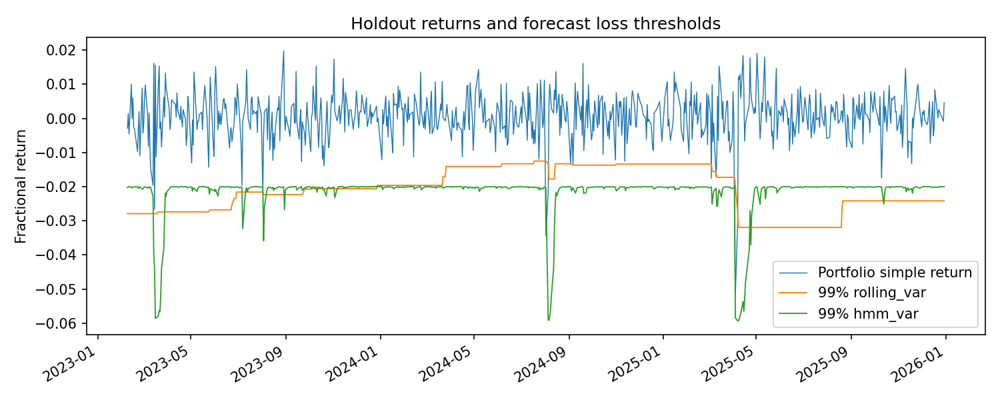
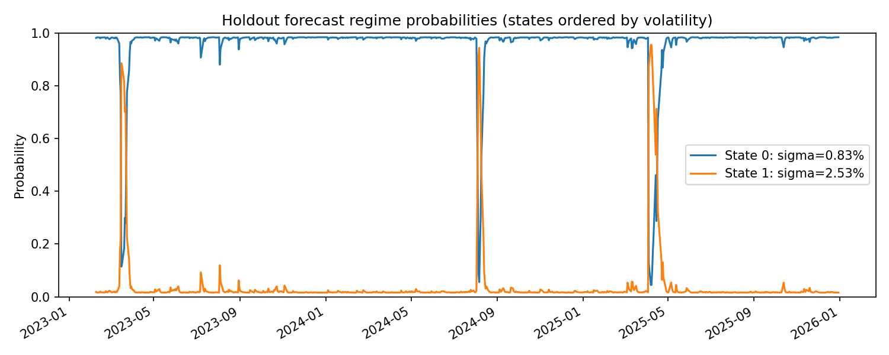

# Regime-Switching Value at Risk Engine

I developed this project alongside my Actuarial Science studies to explore how changes in market conditions affect portfolio risk. It brings together ideas from probability, stochastic processes and statistical inference, applying them to returns from three equity indices.

The question behind it is fairly simple: **when does additional model complexity improve risk measurement, and how can that improvement be tested?**

To investigate this, I compared rolling historical Value at Risk (VaR) with forecasts from a Gaussian Hidden Markov Model (HMM). The HMM allows returns to come from different volatility regimes. It estimates which regime is more likely, then uses that information to construct a forecast return distribution.

The results were mixed. At 99% confidence, the HMM had lower average quantile loss and less observed breach clustering than the historical benchmarks. At 95%, its forecasts were too conservative in terms of realised breach frequency, and the backtests rejected its calibration. That distinction is central to the project. A model can score better than a benchmark while still having weaknesses of its own.

## What the project does

The engine downloads index prices, constructs an equally weighted portfolio return series and calculates historical VaR, historical Expected Shortfall (ES) and Gaussian VaR. It then compares rolling historical VaR with one-observation-ahead HMM forecasts on a chronological holdout.

Both Monte Carlo simulation and a deterministic mixture-quantile solver are implemented. The results reported here use the deterministic solver.

The evaluation includes Kupiec's proportion-of-failures test, Christoffersen's independence test and the combined conditional-coverage test. It also records average VaR and quantile loss, because avoiding breaches alone does not establish a good risk forecast.

## Data and portfolio construction

The portfolio gives equal weight to:

| Index | Yahoo Finance ticker |
|---|---|
| FTSE 100 | `^FTSE` |
| S&P 500 | `^GSPC` |
| Euro Stoxx 50 | `^STOXX50E` |

Prices are retained only on dates available for all three indices. Missing prices are not forward-filled. Asset simple returns are calculated as `P[t] / P[t-1] - 1`, and portfolio return is their weighted average, corresponding to rebalancing at each retained observation.

The verified dataset contains 1,449 price observations and 1,448 returns. Its prices run from 3 January 2020 to 30 December 2025. Compared with the earlier dataset, the corrected download removed 98 dates; prices on all shared dates were identical.

There are practical limitations here. These are local-currency equity indices, without FX conversion, transaction costs or an explicit dividend-reinvestment model. Adjusting downloaded prices does not turn a price index into a total-return index. Exchanges also close at different times. Restricting the data to common dates avoids artificial zero returns from forward-filling, but some return intervals still span local holidays.

The forecast horizon is therefore the next retained observation, approximately a trading day. The output is a fractional portfolio return, not monetary P&L. The function name `portfolio_pnl` is retained from the earlier implementation.

## How the model is evaluated

The first **750 returns**, from 6 January 2020 to 7 February 2023, are used to fit the HMM. The remaining **698 returns**, from 8 February 2023 to 30 December 2025, form the holdout.

The model is fitted to the aggregate portfolio return series, so it is a univariate HMM. It does not model regime-dependent correlations between individual assets. Three initialisations are compared using training likelihood, with only converged fits eligible for selection. All three converged in the reported experiment. The fitted states are ordered by increasing volatility rather than assigned economic labels in advance.

Parameters are then held fixed. Regime probabilities continue to update as returns arrive.

For a forecast at observation t, the filter uses returns through t-1 and projects the state probabilities through the transition matrix. The VaR is calculated from this forecast Gaussian mixture. Historical VaR uses only the preceding 250 or 500 returns. Both models are evaluated on exactly the same dates, and unavailable forecasts are excluded before breach indicators are constructed.

Historical VaR, ES and Gaussian VaR reported separately in the summary describe the training sample. The holdout backtests apply to rolling historical VaR and HMM VaR.

## Results

The sensitivity analysis compares 95% and 99% confidence levels with historical windows of 250 and 500 observations. The data, training period and HMM settings remain fixed throughout.

| Confidence | Historical window | Historical breaches | HMM breaches | Historical mean VaR | HMM mean VaR | HMM quantile-loss reduction |
|---|---:|---:|---:|---:|---:|---:|
| 99% | 250 | 7 | 3 | 2.1034% | 2.1726% | 22.54% |
| 99% | 500 | 5 | 3 | 2.3004% | 2.1726% | 21.78% |
| 95% | 250 | 28 | 14 | 1.1515% | 1.4310% | 2.17% |
| 95% | 500 | 20 | 14 | 1.2738% | 1.4310% | 4.48% |

Expected breaches are 6.98 at 99% confidence and 34.90 at 95%. Changing the historical window affects only the benchmark, which is why the HMM results repeat within each confidence level. These are not independent replications.

### At 99% confidence

The HMM recorded three breaches, with no consecutive breach transitions. Its Kupiec, independence and conditional-coverage p-values were 0.0877, 0.8721 and 0.2297. None rejects at the 5% significance level. Both historical benchmarks reject independence and conditional coverage.

The lower average quantile loss is encouraging: a reduction of roughly 22% against either historical window. The HMM's average VaR was slightly larger than the 250-observation benchmark's, but smaller than the 500-observation benchmark's. Its relative performance cannot simply be attributed to always setting a larger loss threshold.



### At 95% confidence

The HMM produced 14 breaches against approximately 35 expected. Its Kupiec p-value was about 0.000040, with independence and conditional-coverage p-values of 0.0274 and 0.000019. All three reject at 5%.

This is a weakness. Although average quantile loss remained slightly lower than for either benchmark, the HMM did not achieve the intended breach frequency, and there was evidence of dependence in the breaches. Both historical benchmarks also reject conditional coverage at this confidence level.



### What I take from the comparison

The HMM's results at 99% suggest that allowing risk to depend on market conditions can help it respond after a shock. But the 95% results limit the conclusion. Better average forecast scores do not necessarily mean better calibration across the distribution.

These comparisons use one holdout which had already been inspected before the sensitivity analysis. They are exploratory. The quantile-loss differences have not been tested for statistical significance, and the small number of extreme breaches limits inference. Further model selection would need a separate, untouched evaluation period.

The evidence supports a sample-specific finding, rather than a general claim that regime-switching VaR is superior.

Full summaries are available for [99% / 250](docs/results/var99_window250.json), [99% / 500](docs/results/var99_window500.json), [95% / 250](docs/results/var95_window250.json) and [95% / 500](docs/results/var95_window500.json).

## Understanding the measures

At confidence alpha, `VaR = -quantile(return, 1-alpha)`. A breach occurs when `return < -VaR`. VaR is a quantile, not a maximum possible loss. It is usually positive for market returns, but the code does not force it to be positive if the corresponding return quantile is positive. Historical ES averages the returns at or below the empirical threshold, including ties, and reports the negative of that average.

Quantile loss evaluates the forecast return threshold. With `tau = 1-alpha` and `u = realised return + VaR`, the score is `u * (tau - I[u < 0])`. Lower average loss is better. The reductions in the table compare models at the same confidence level.

Kupiec tests the target breach frequency. Christoffersen independence tests first-order dependence between breach indicators; conditional coverage combines the two likelihood-ratio statistics. Their p-values use asymptotic chi-square distributions. Non-rejection does not prove calibration, particularly when breaches are sparse. Where one predecessor state is unobserved, the engine reports independence and conditional coverage as `null` rather than presenting an uninformative pass.

## Running the project

Use Python 3.10 or newer. From the repository root:

```bash
python -m venv .venv
source .venv/bin/activate
python -m pip install -e ".[dev]"
python -m pytest -q
```

On Windows PowerShell, activate with `.venv\Scripts\Activate.ps1` instead.

Download prices and run the baseline:

```bash
python scripts/fetch_prices.py --start 2020-01-01 --end 2026-01-01 --output data/market_prices_verified.csv
python scripts/run_var.py --prices data/market_prices_verified.csv --train-size 750 --window 250 --alpha 0.99 --output results/verified_metrics
```

The download end date is exclusive. Yahoo access is required, and an empty or failed download raises an error. Directories are created automatically.

To reproduce the other configurations:

```bash
python scripts/run_var.py --prices data/market_prices_verified.csv --train-size 750 --window 500 --alpha 0.99 --output results/sensitivity_99_500
python scripts/run_var.py --prices data/market_prices_verified.csv --train-size 750 --window 250 --alpha 0.95 --output results/sensitivity_95_250
python scripts/run_var.py --prices data/market_prices_verified.csv --train-size 750 --window 500 --alpha 0.95 --output results/sensitivity_95_500
```

The default quantile method is named `bisection` for compatibility; its implementation uses Brent's bracketed root solver. To use Monte Carlo instead:

```bash
python scripts/run_var.py --prices data/market_prices_verified.csv --method mc --n-sims 50000 --seed 42 --output results/monte_carlo
```

Custom weights can be passed with `--weights 0.5 0.3 0.2`, in CSV column order. They must be non-negative and sum to one. A custom price CSV needs one `date`, `Date` or `DATE` column and finite, strictly positive prices. Missing prices and duplicate dates are rejected. Use `--help` for the full set of options, or `--no-plots` to omit charts.

## Outputs and reproducibility

Each run saves:

- `summary.json`: input hash, configuration, dates, software versions, HMM parameters and convergence diagnostics, backtests, average VaR and average quantile loss.
- `forecasts.csv`: realised returns, VaR forecasts, breach flags, observation-level quantile losses and forecast regime probabilities.
- `var.png` and `regimes.png`: saved charts, without requiring an interactive display.

The reported dataset has SHA-256:

```text
c5c8be11a461dd2c761699da4f2c7f6ab9c0af4d7f091b9a4b8199cafbf82647
```

The input CSV is not bundled with the summaries. A hash identifies a file but cannot reconstruct it, and a fresh Yahoo download may change as historical data are revised. Keep the exact input alongside the results and record the environment:

```bash
python -m pip freeze > results/verified_metrics/environment.txt
```

## Validation and remaining work

The tests cover price validation, portfolio-return arithmetic, exclusion of unavailable forecasts, preservation of breach adjacency, future-data invariance, mixture quantiles, reference test statistics and command-line execution. Passing those checks establishes software behaviour; empirical model performance needs separate evaluation.

Earlier results from this project were withdrawn after identifying full-sample HMM fitting and missing forecasts being counted as non-breaches. The current design corrects both issues. The subsequent data review also removed forward-filled dates. The tables above use the corrected common-date dataset.

Fixed HMM parameters can become stale. Exploring a pre-specified refitting schedule would be a useful next step, alongside uncertainty estimates for forecast-score differences and evaluation on a separate period. A common-currency total-return portfolio would address further limitations of the current inputs. These are possible extensions, not features already implemented.

## Code layout

| Location | Purpose |
|---|---|
| `scripts/fetch_prices.py` | Download and clean index prices |
| `scripts/run_var.py` | Run the holdout experiment and save outputs |
| `src/risk_engine/io/prices.py` | Load and validate price CSVs |
| `src/risk_engine/analytics/returns.py` | Calculate simple and log asset returns |
| `src/risk_engine/analytics/var_es.py` | Portfolio returns and VaR/ES calculations |
| `src/risk_engine/analytics/regimes.py` | HMM fitting, filtering and mixture quantiles |
| `src/risk_engine/analytics/backtests.py` | Forecast alignment and statistical tests |
| `tests/` | Automated regression and integration tests |
| `docs/results/` | Selected summaries and charts from the verified runs |

## References

- Kupiec, P. (1995), *Techniques for Verifying the Accuracy of Risk Measurement Models*.
- Christoffersen, P. (1998), *Evaluating Interval Forecasts*.
- Hamilton, J. D. (1989), *A New Approach to the Economic Analysis of Nonstationary Time Series and the Business Cycle*.
- [hmmlearn documentation](https://hmmlearn.readthedocs.io/en/stable/api.html).

This project is for educational and research purposes, not investment advice or a production risk system.
